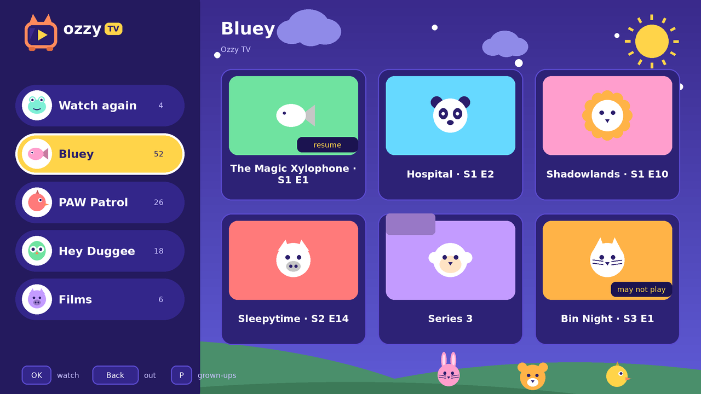
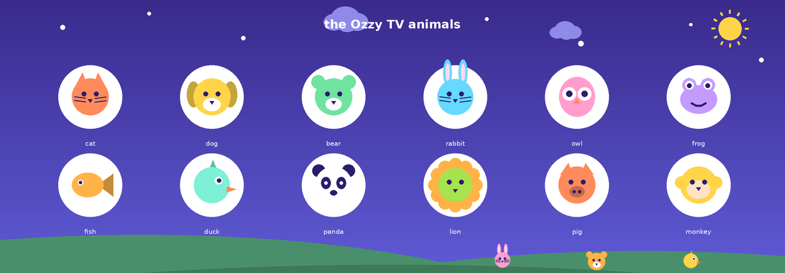
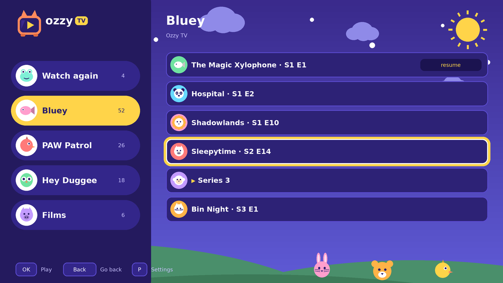

# Ozzy TV


A television app for a toddler, on a Raspberry Pi 3.

Roku-shaped menus — a list of shelves down the left, big tiles across the right,
one unmistakable selection — painted for a two-year-old: a sky with clouds and
hills, sweet colors, and an animal on everything.



Point it at a folder of films and shows. Your child sees big tiles and
nothing else — no settings, no way out to a desktop. You decide, per file or per
folder, what is on those tiles.

**What you put on the drive is what shows up.** You already decided when you
copied the file on. If there is something you would rather your child did not
find, block it from the grown-ups screen — per file or per folder — and it stays
blocked, including anything added to that folder later.

---

## Install

**Raspberry Pi OS Lite is the one to use** (Trixie, Bookworm or Bullseye, 32- or
64-bit, Pi 3 or newer). Lite has no desktop, which is exactly what this wants: Ozzy TV
starts its own bare X session with no window manager, so there is nothing behind
it for a child to reach and about 10 MB of RAM spent on the menus instead of a
desktop.

It works on the **Desktop** image too. The installer notices the display manager,
switches it off so Ozzy TV can have the screen, and writes down what it changed —
`--uninstall` gives the desktop back.

```sh
git clone https://github.com/assume-breach/OzzyTV.git
cd OzzyTV
sudo ./install/install.sh
```

Then:

```sh
sudo -u "$USER" ozzytv --set-pin           # do this first
cp ~/films/*.mp4 /media/ozzy/              # put something there
ozzytv --scan                              # see what it found
ozzytv --allow /media/ozzy/Bluey           # let that through
sudo reboot                                # comes up into Ozzy TV
```

The Pi now boots straight into Ozzy TV with no desktop behind it. To get back to
a console: **Ctrl-Alt-F2**, or ssh in.

`sudo ./install/install.sh --uninstall` puts the console back. It leaves your
media and your choices alone.

## The animals

Every shelf and every show gets a creature and a color, chosen by hashing
its name. A child who cannot read "Bluey" or "Series 1" can absolutely remember
that theirs is the green frog, and it stays the green frog across a rescan, a
reboot and a new SD card.



Nothing on one screen ever wears the same animal as its neighbor. A hash on its
own cannot promise that — twelve creatures and six tiles collide about three
times in four, and the first render of the home screen put four pandas on it — so
each name asks for its animal and takes the next one along if it is already
spoken for.

## Using it

**Your child** needs four buttons. Any USB remote works — they present as
keyboards — and so does a plain keyboard.

| | |
|---|---|
| Up / Down | move down the shelves, or the tiles |
| Right / OK | cross from the shelves to the tiles |
| Left / Back | back to the shelves |
| OK on a tile | open a folder, play a show, pause |
| + / − | volume (bounded, so the telly never ends up silent) |

Back at the top level does nothing. That is the point: holding Back is how a
child looks for a way out, and there is not one.



**You** press **P** and enter the PIN. That gets you a list of everything on the
drive — including what your child cannot see — with what each row is doing and
why. OK cycles a row through allowed → blocked → inherits-from-its-folder. The
first press always changes what your child sees.

You can do the same from a terminal, which is easier before the Pi is plugged
into a TV at all:

```sh
ozzytv --scan                                    # the whole library, with its rules
ozzytv --allow "/media/ozzy/PAW Patrol"          # a folder, and anything added to it later
ozzytv --block "/media/ozzy/PAW Patrol/S03E12.mp4"   # except this one
ozzytv --forget "/media/ozzy/Films"              # back to inheriting
```

### Hiding something

Mark a file or a folder. A folder's mark covers everything inside it, and the
**nearest** mark wins — so "allow Bluey, block Bluey/S02E14" reads the way it
looks. Anything with no mark above it is hidden.

Allowing a folder is a **standing yes**: things added to it later are visible
too. That is normally what you mean, and the parent screen says so on the row.

## What runs where

```
ozzytv/picks.py      what your child may see           ← the safety boundary
ozzytv/app.py        every screen and every keypress   ← all the behavior, no drawing
ozzytv/skin.py       the look: layout, palette, animals, logo  ← a View becomes a Scene
ozzytv/scene.py      shapes and words with coordinates, and nothing else
ozzytv/tkview.py     the only file that touches a screen        ← a Scene becomes Tk
tools/mockup.py      the same Scene, rendered to PNG            ← the pictures above
ozzytv/library.py    the drive → shelves and tiles
ozzytv/playback.py   VLC behind a small interface, plus resume and volume limits
ozzytv/security.py   the PIN, and making guesses cost time
ozzytv/probe.py      whether this Pi can actually play a file
ozzytv/store.py      one SQLite file: your choices, positions, history
ozzytv/cec.py        optional: the TV's own remote, over HDMI-CEC
```

The layout is data. `skin.py` turns a screen into a list of shapes with
coordinates and touches nothing; two things draw that list — Tk on the
television, and `tools/mockup.py` into a PNG. So the pictures in this README are
not impressions of the design, they are the screen, and "the focused tile is
bigger than its neighbors" is a test rather than an opinion about a screenshot.

```sh
python3 tools/mockup.py          # re-render docs/mockups/ after a change
```

`app.py` holds the behavior and draws nothing, so the whole of what a remote
can do is driven by the tests without a screen. Software for a four-year-old is
exactly the kind nobody tests, because testing it looks like it needs a
television — and the user cannot report a bug.

```sh
pip install pytest && pytest        # no VLC, no display, no Raspberry Pi needed
```

The installer is tested too — against a temporary root, with apt, systemctl and
usermod replaced by recorders. An installer that is only ever run for real is one
nobody finds out is broken until a Pi has already been wiped to try it.

## Raspberry Pi OS versions

| | |
|---|---|
| Trixie (Debian 13) | Python 3.13 — current Raspberry Pi OS |
| Bookworm (Debian 12) | Python 3.11 — the one this is developed against |
| Bullseye (Debian 11) | Python 3.9 — supported, and tested for by `tests/test_runs_on_the_pi.py` |

That test exists because Bullseye's 3.9 is older than anything this is written
on, and the gap that bites is silent: `A | B` in an annotation is free (the
modules defer annotations), but the same thing as a type ALIAS runs at import and
raises `TypeError` on 3.9. One had crept in, and the app would not have started
on Bullseye at all — with a message about unsupported operand types rather than
about a Python version.

Everything the installer needs is a stock Raspberry Pi OS package: `vlc`,
`python3-vlc`, `python3-tk`, `xserver-xorg`, `xinit`, `x11-xserver-utils`,
`unclutter`, and optionally `ffmpeg` and `cec-utils`. Nothing comes from PyPI —
python-vlc from pip can be a different version from the libvlc apt installed,
which fails at import complaining about a missing symbol.

## On a Pi 3 specifically

A Pi 3 decodes **H.264 up to 1080p30** in hardware. Give it HEVC, VP9, AV1 or
anything 4K and VLC decodes on four 1.2 GHz cores, which produces a slideshow
with perfect sound.

With `ffmpeg` installed (the installer adds it), Ozzy TV checks files and marks
the ones it thinks will struggle — **in the parent screen**, next to the file,
before you allow it. The point is which of you finds out.

```sh
ozzytv --scan --check
```

To re-encode something it will not play:

```sh
ffmpeg -i big.mkv -c:v libx264 -preset slow -crf 20 -vf scale=-2:1080 -c:a aac ozzy.mp4
```

**If video stutters or the screen stays black while sound plays**, that is the
video output, and `vlc_args` in `~/.local/share/ozzytv/settings.json` is the
knob. It is **empty by default on purpose** — VLC picks a working output on its
own, and a hardware flag copied from a forum post is the usual cause of the
problem it is supposed to fix. Change one thing at a time and test with
`ozzytv --windowed`.

**No sound over HDMI?** Check the Pi is not sending audio to the headphone jack:
`sudo raspi-config` → System → Audio.

## When the screen stays black

```sh
ozzytv --doctor
```

That is the first thing to run, and usually the last. Its first line says which
version is installed — check that before anything else, because "I reinstalled
and it is still broken" is usually an installer re-run against an older copy of
the repo sitting beside the new one.

```sh
ozzytv --selftest
```

Draws every screen with no display, no X and no VLC, through the real renderer,
and says which one broke. `install.sh` runs it and refuses to finish if it
fails, so a Pi proves its own menus paint before anybody is in front of a
television. It exists because the opposite happened: the app died on one line of
`TkView.__init__` on every boot, and the only symptom was a black screen. It walks the chain from
"can Python find this package" through tkinter, libVLC, the display, the media
folder and the boot service, and for anything broken it prints the command that
repairs it.

**A black screen with a white X cursor** is a specific symptom, not a general
one: the X server started and nothing ever drew on it. The app died on startup
and the session script looped on it. The reason is in two places —

```sh
ozzytv --doctor
journalctl -u ozzytv@$USER -n 50 --no-pager
```

— and, since the session script now catches it, on the television itself: after
three immediate failures it puts the error on the screen rather than leaving a
black rectangle and an X.

To watch it fail in front of you, stop the service and start it by hand. The
traceback lands in your terminal instead of the journal:

```sh
sudo systemctl stop ozzytv@$USER
startx /usr/local/bin/ozzytv-session -- :0 vt1 -keeptty
```

**Re-running `sudo ./install/install.sh` repairs all of this** and keeps your
settings, your PIN and your allow/block choices. It is the upgrade path as well.

## Getting shows onto it

**The installer sets up a network share by default** — copying films onto a
memory stick and walking them over is not an answer to "how do I add a
show". It asks for a password as it goes.

```sh
sudo ./install/install.sh --no-share   # skip it
sudo ./install/share.sh --password     # change the password later
sudo ./install/share.sh --disable      # stop sharing; puts smb.conf back
sudo ./install/share.sh                # turn it back on
```

`/media/ozzy` then appears as `\\ozzytv\ozzytv` — `smb://<pi>/ozzytv` from a Mac
or Linux box, `\\<pi>\ozzytv` from Windows.

**No username, no password.** Dropping a film on a Pi should not involve a
credential. Anyone on your network can read and write that one folder; on a home
network that is the point. What keeps it reasonable is everything around it:

| | |
|---|---|
| One folder | the one the television reads. Not home, not the app, not the disk |
| The house only | `hosts allow` is private ranges. If this Pi is ever put on a network it does not own, that line is what stops the folder going with it |
| SMB2 and up | SMB1 is off. It is how most of the well-known file-sharing worms travel |
| No printers, no usershares | nothing else is exposed, and nobody can add anything |

**Windows 10 and 11 refuse guest shares out of the box.** Either turn on
"Insecure guest logons", or use a login:

```sh
sudo ./install/install.sh --share-private   # at install time
sudo ./install/share.sh --password          # or later
```

A share made private stays private when the installer is re-run.

Files land owned by the television's user whatever a laptop calls itself, so
they are readable rather than arriving as somebody else's and leaving the menu
empty.

**New shows appear on their own, within a few seconds** — there is nothing
to restart. Ozzy TV watches folder modification times, one stat per folder
rather than a walk of the drive, and only while nothing is playing. You still
have to allow them for your child; that part is deliberate and stays manual.

## DVDs

A USB DVD drive shows up on the home screen. Put a disc in, press it, and VLC
plays it — menus and all. There is nothing to rip.

The installer adds `libdvdnav4` and `libdvdread8`, which read the disc
structure. They do **not** decrypt: most commercial DVDs are CSS scrambled, and
Debian ships the decryptor as a source package you build yourself, for licensing
reasons. Home-made and unencrypted discs play as they are; for the rest:

```sh
sudo apt install libdvd-pkg && sudo dpkg-reconfigure libdvd-pkg
```

The drive is listed even with no disc in it, marked "no disc" — a tile that
appears and vanishes depending on what is loaded is worse than one that tells
you. A disc is not covered by the allow/block rules: putting one in the machine
is itself the grown-up act.

## Driving it with a mouse

Made for a remote, and it stays that way — but a mouse works. Click a shelf to
open it, click a show to play it. On the parent screen a click moves to a
row; allowing or blocking still takes OK, because that is a decision and a stray
click is not one.

The pointer shows itself when you move it and disappears three seconds after you
stop, because a child will find the mouse and then let go of it.

## Settings

`~/.local/share/ozzytv/settings.json` — edit it over ssh; nothing here is secret.
Broken JSON is moved aside and defaults are used, because a stray comma must not
stop a child's television from working.

| | |
|---|---|
| `media_roots` | folders to show. A list — internal storage *and* a USB stick |
| `columns`, `rows` | tiles per screen. 3×2 suits a 1080p TV from a sofa |
| `resume` | pick up where they left off |
| `volume_min`, `volume_max` | how quiet and how loud a child may make it |
| `parent_keys` | which keys open the PIN pad |
| `cec` | drive it from the TV's remote (needs `cec-utils`) |
| `vlc_args` | extra libVLC arguments. See above before touching |

## What this does not do

No network, no streaming, no accounts, no telemetry. It plays files that are
already on the machine. Nothing leaves the Pi, and it works with the router
switched off.

There is no watch-timer or bedtime lock. Say the word and I will add one.

## License

MIT — see [LICENSE](LICENSE). Do what you like with it.

VLC does the playing and is not bundled; it comes from the Raspberry Pi OS
packages and stays under its own license.
